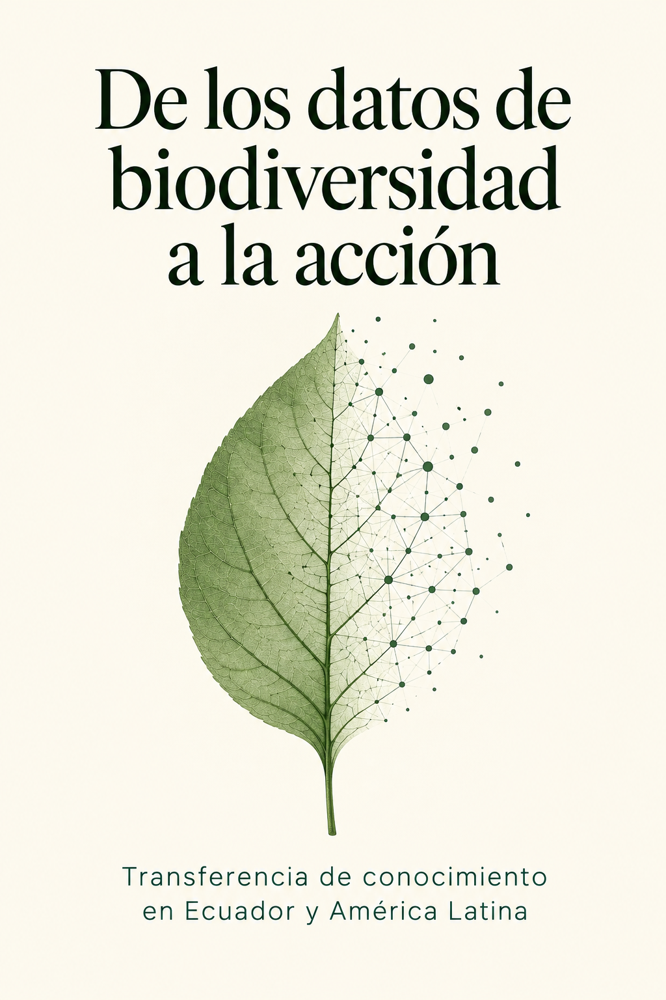

## Prefacio

¿Cómo se transforma un registro de biodiversidad en conocimiento útil para la conservación? Este libro explora el recorrido desde las colecciones biológicas y las observaciones de especies hasta su interpretación y aplicación en decisiones, con énfasis en Ecuador y ejemplos de América Latina. Examina la calidad de los datos, los sesgos de muestreo y el intercambio de conocimiento entre investigadores, comunidades e instituciones. A partir de una revisión exploratoria de literatura, identifica oportunidades y limitaciones para conectar la información biológica con la práctica. Su propósito es ofrecer una mirada accesible sobre las capacidades y colaboraciones necesarias para que los datos contribuyan a una conservación mejor informada.

